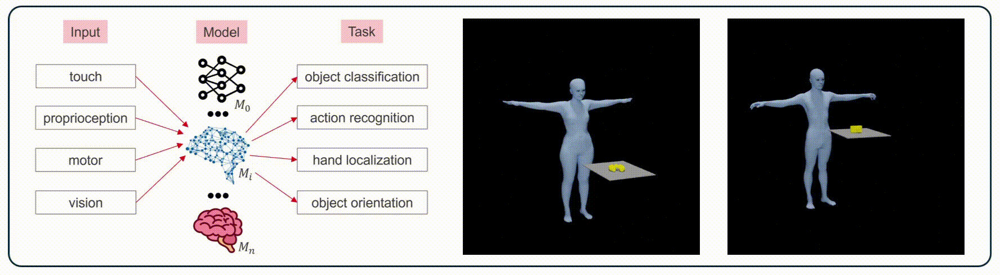

<p align="center">

  <h2 align="center"><b>DeepGrasp</b>: Modeling digital humans with task-driven learning</h1>

  <p align="center"></p>
  
  <h5 align="center"> Bartlomiej Borzyszkowski
   <br>
   <a href="mailto:bartlomiej.borzyszkowski@epfl.ch">[bartlomiej.borzyszkowski@epfl.ch]</a>
   <br>
   <br>
  School of Computer and Communication Sciences
    <br>
   Swiss Federal Institute of Technology Lausanne (EPFL)
  </h5>
</p>
<br>

Task-driven learning with deep neural networks is a powerful, emerging approach to elucidate and model computations in the brain. This work focuses on human-object interaction and aims to better understand, predict, and model human behaviour using digital avatars. We train a Graph Neural Network (GCN) with spatial and temporal attention on multi-modal data, including body pose and touch signals. Our results show that the model learns a robust neural representation capable of solving multiple classification and regression tasks in 3D space, such as action recognition and object classification. Ultimately, new insights into proprioceptive and tactile pathways can contribute to more accurate models of the sensorimotor system, advancing active research in computational neuroscience.

## Installation

The software has been tested on Ubuntu 20.04 with CUDA 12.4 and Python3.10.

First, install the Python Development Headers:
```
sudo apt-get install python3.10-dev
```

We recommend installing further dependencies in the virtual environment:
```
python3 -m venv venv_DeepGrasp
source venv_DeepGrasp/bin/activate
```

The project uses [PyTorch Geometric Temporal](https://pytorch-geometric-temporal.readthedocs.io/en/latest/index.html), extension library of PyTorch for Temporal Graph Neural Networks (T-GCNs) with a GPU acceleration. As a first step, install [PyTorch](https://pytorch.org/get-started/locally/), [PyTorch Geometric](https://pytorch-geometric.readthedocs.io/en/latest/notes/installation.html) and [PyTorch Geometric Temporal](https://pytorch-geometric-temporal.readthedocs.io/en/latest/notes/installation.html) for your CUDA Version following official instructions. Recommended versions are:
- PyTorch: `torch-2.4.1+cu124` `torchaudio-2.4.1+cu124` `torchvision-0.19.1+cu124`
- PyTorch Geometric: `torch-geometric-2.6.1` `pyg_lib-0.4.0+pt24cu124`
- PyTorch Geometric Temporal: `torch-geometric-temporal-0.54.0`

Finally, install the remaining project requirements:
```
pip install -r requirements.txt
```

## Download dataset
This work is based on the [GRAB](https://grab.is.tue.mpg.de/) dataset. Follow steps in the [source repository](https://github.com/otaheri/GRAB#getting-started) to download the dataset.

- Download GRAB (ZIP files) from [the source website](http://grab.is.tue.mpg.de). Please do NOT unzip the files yet.
- Make sure to get access to the **object_meshes.zip** before continuing to the next steps.
- Put all the downloaded ZIP files for GRAB in your destination directory.
- Run the following command to extract the ZIP files:

    ```Shell
    python3 -m tools.unzip_grab  --grab-path $PATH_TO_FOLDER_WITH_ZIP_FILES \
                                 --extract-path $PATH_TO_EXTRACT_GRAB_DATASET_TO
    ```
- The extracted data should be in the following structure:
    ```Shell
        GRAB
        ├── grab
        │   │
        │   ├── s1
        │   └── ...
        │   └── s10
        │
        └── tools
            ├── object_meshes
            └── object_settings
            └── subject_meshes
            └── subject_settings
            └── smplx_correspondence

    ```

## Download body models
This work is based on the 3D body models [SMPL-X](https://smpl-x.is.tue.mpg.de) and [MANO](https://mano.is.tue.mpg.de/) that capture detailed body, face, and hand movements in a unified framework. SMPL-X incorporates facial expressions and articulated fingers, allowing for expressive and naturalistic human representations. The models are widely used in computer vision, graphics, and deep learning, enabling realistic human pose estimation and motion synthesis from images, videos, or motion capture data. 

- Download the SMPL-X model from the original source: [https://smpl-x.is.tue.mpg.de](https://smpl-x.is.tue.mpg.de)
- Download the MANO model from the original source: [https://mano.is.tue.mpg.de](https://mano.is.tue.mpg.de)
- Extract the ZIP files with models in your desired directory.
- The extracted data should be in the following structure:
    
    ```Shell
        models
        ├── smplx
        │   │
        │   ├── SMPLX_FEMALE.pkl
        │   └── SMPLX_MALE.pkl
        │   └── ...
        │
        └── mano
            ├── MANO_RIGHT.pkl
            └── MANO_LEFT.pkl
            └── ...
    ```

## Start the project
- <b>Data preprocessing:</b> <br>


    Modify desired configuration parameters at `configs/preprocessing_cfg.yml`.

    ```Shell
    python3 run_preprocessing.py  --grab-path $PATH_TO_EXTRACTED_GRAB_DATASET \
                                  --model-path $SMPLX_MODEL_FOLDER \
                                  --out-path $PATH_TO_SAVE_PREPROCESSED_DATASET
    ```
- <b>Training:</b> <br>

    Modify desired configuration parameters at `configs/training_cfg.yml`.

    To track your ML experiments via [neptune.ai](https://neptune.ai/), export env variables `NEPTUNE_API_TOKEN` & `NEPTUNE_PROJECT` for your Neptune project. If not specified, tracking is done offline.

    ```Shell
    python3 run_training.py  --work-dir $TRAINING_DIRECTORY \
                             --data-path $PATH_TO_PREPROCESSED_DATASET \
                             --expr-ID $ID_OF_YOUR_EXPERIMENT
    ```
    Detailed results will be available in your `work_dir` and can be inspected as TensorBoard and Neptune artifacts.

## Contact and technical support
- <b>Bartlomiej Borzyszkowski</b> <br>
    Mail: <a href="mailto:bartlomiej.borzyszkowski@epfl.ch">bartlomiej.borzyszkowski@epfl.ch</a> <br>
    Web: <a href="https://borzyszkowski.github.io/">borzyszkowski.github.io</a>
